<h1 style="background-color:#6B4DE6; color: white; padding: 15px;">TwitchIn </h1>

<h2>What makes us special? </h2>
<ul>
    <li>
        "We are a hybrid platform that combines the professional networking capabilities of LinkedIn with the interactive streaming features of Twitch."
    </li>    
</ul>

<h2>Features </h2>
<ol type="1">
    <li> <a href="#feature1">User Profile Page .</a></li>
    <li> <a href="#feature2">Home/Feed Page .</a></li>
    <li> <a href="#feature3">Connections Page.</a></li>
    <li> <a href="#feature4">Messaging Page.</a></li>
    <li> <a href="#feature5">Notifications Page.</a></li>
    <li> <a href="#feature6">Search Functionality.</a></li>
    <li> <a href="#feature7">Company Pages.</a></li>
    <li><a href="#feature8">Profile Edit Page.</a></li>
    <li> <a href="#feature9">Used Chart.js to display interactive charts or graphs.</a></li>
    <li> <a href="#feature10">Dark Mode Toggle Bar.</a></li>
    <li> <a href="#feature11">Navigate to Top.</a></li>
    <li> <a href="#feature12">Design inspired from Twitch’s aesthetic.</a></li>
    <li> <a href="#feature13">Fully Responsive for all types of Screen (Mobile, Tablet & Desktop).</a></li>
    <li> <a href="#feature14">Clean, maintainable, and well-documented code.</a></li>
    <li> <a href="#feature15">Creative & Innovative User Experience.</a></li>
    <li> <a href="#feature16">Smoothness and Intuitiveness of interactive elements.</a></li>
    <li> <a href="#feature17">Creative & Innovative User Experience.</a></li>

</ol>
 

<h3>Tech Stack Used: </h3>
<ol>
    <li>HTML5.</li>
    <li>CSS3.</li>
    <li>JavaScript.</li>
    <li>Chart.js.</li>
</ol>

<h2> Getting into the Functionalities </h2>

<h2 id="feature1">1. User Profile Page</h2>

Display a detailed user profile similar to LinkedIn, including profile 
picture, name, headline, summary, experience, education, and a list of skills.

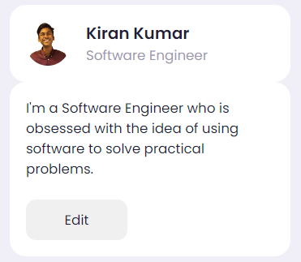  

<h2 id="feature2">2. Home/Feed Page </h2>

 Implement a home page with a feed that displays user posts with text, images, videos, and links. Each post should have engagement options like "like," 
"comment," and "share."

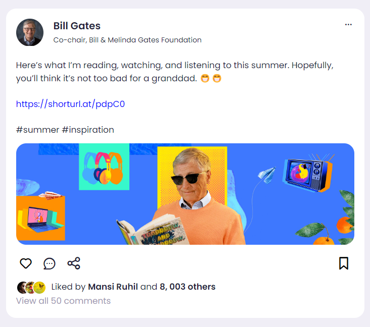    

<h3>After Like & Bookmarks </h3>
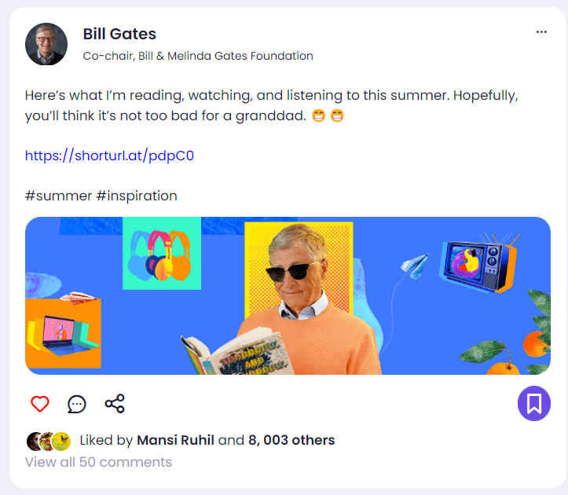    

<h2 id="feature3">3. Connections Page</h2>

Show a list of connections with profile pictures, names, and current positions. Include options to add or remove connections.

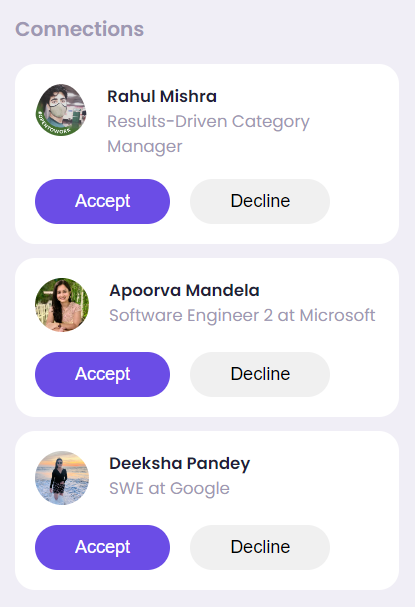    

<h2 id="feature4">4. Messaging Page</h2>

Implement a messaging feature similar to LinkedIn's InMail, allowing users to send and receive messages.

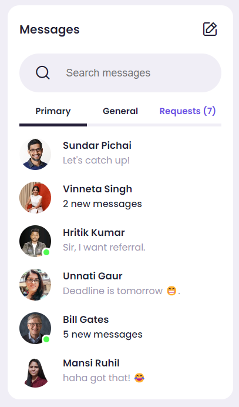    

<h2 id="feature5">5. Notifications Page</h2>

 Display a notification section showing recent activity, such as new connection requests, likes, comments, and messages.

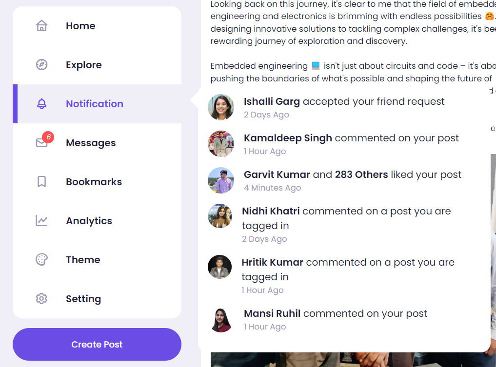    

<h2 id="feature6">6. Search Functionality </h2>

 Include a search bar to search for users, posts, or companies.

<!--   -->
<h3>Before Searching </h3>
    
<h3>After Searching </h3>
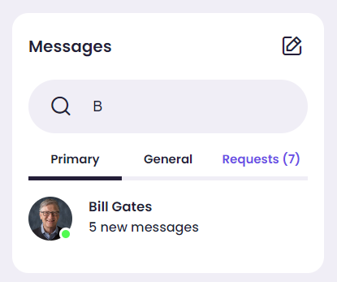    

<h2 id="feature7">7. Company Pages</h2>

Display sample company pages with company information, posts, and employees.

    

<h2 id="feature8">8. Profile Edit Page</h2>

Create a page where users can edit their profile information, including personal details, experience, and skills.

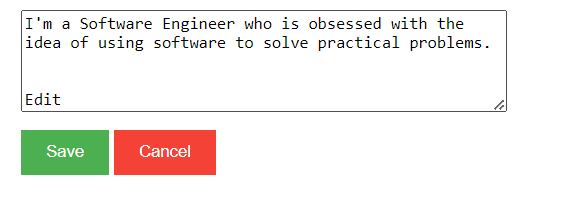    

<h2 id="feature9">9. Used Chart.js to display interactive charts or graphs.</h2>  

Using Chart.js, an open-source JavaScript library, to display interactive charts or graphs enhances data visualization in web applications. It supports various chart types like line, bar, and pie, and offers customization options for colors, labels, and tooltips. With interactivity features such as hover details and zooming, users can engage with data in real-time, making analysis more intuitive. Chart.js integrates easily with other JavaScript frameworks, allowing developers to present complex data sets in a visually appealing and user-friendly manner.
     
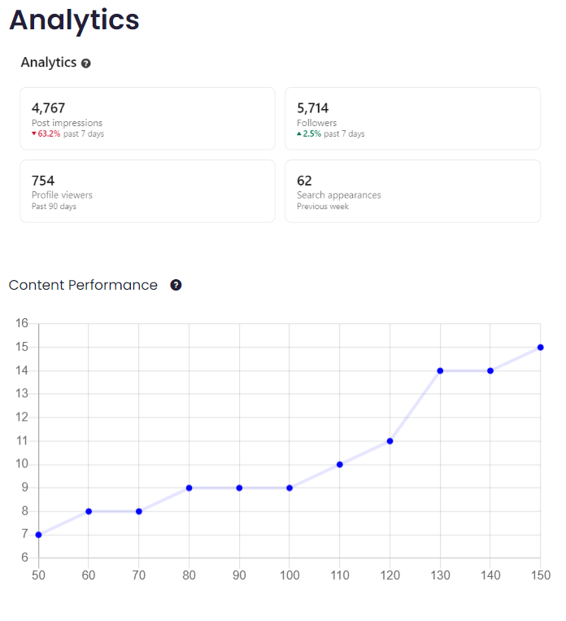    

<h2 id="feature10">10. Dark Mode Toggle Bar.</h2>

The Dark Mode Toggle Bar feature allows users to switch between light and dark themes seamlessly. This enhances user experience by providing a visually comfortable option for different lighting conditions, reducing eye strain, and catering to personal preferences. The toggle bar is easy to access and use, ensuring that users can quickly adapt the interface to their liking, improving overall usability and satisfaction.
    
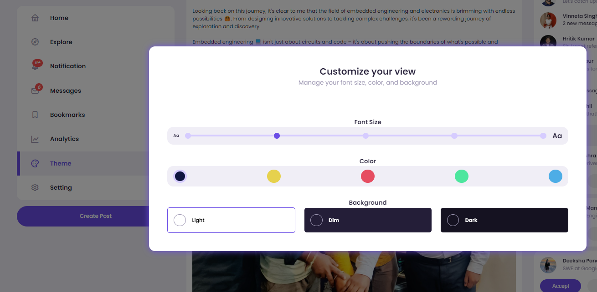
  
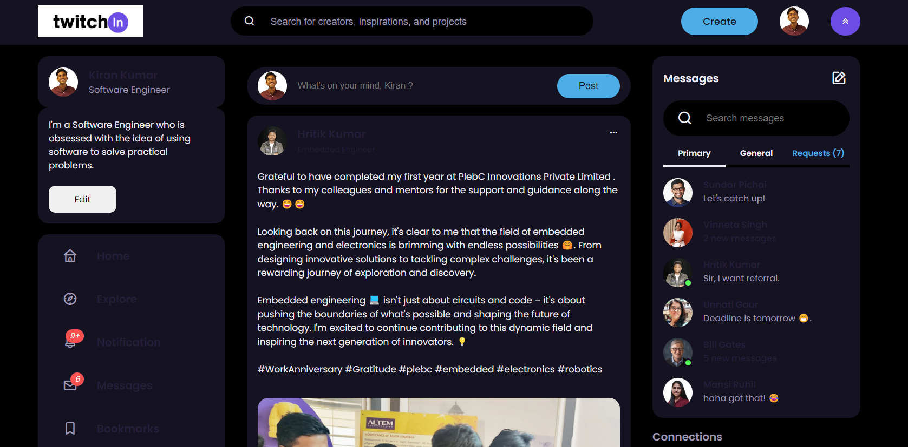     

<h2 id="feature11">11. Navigate to Top </h2>   

The "Navigate to Top" feature in my project provides a seamless user experience by allowing users to quickly scroll back to the top of the page with a single click. This functionality improves navigation efficiency, especially on long pages, ensuring users can easily access important content or menu options without manual scrolling. It's implemented using smooth scrolling effects for a polished and user-friendly interface.
  
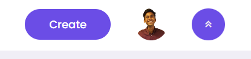      

<h2 id="feature12">12. Design inspired from Twitch’s aesthetic.</h2>

The design of the project draws inspiration from Twitch's aesthetic, incorporating its sleek, modern, and vibrant visual elements. This includes a dark mode interface, bold typography, and interactive elements that enhance user engagement. The design aims to create an immersive experience similar to Twitch, appealing to users with its dynamic and visually appealing layout. By adopting these design principles, the project ensures a contemporary and familiar look that resonates with a broad audience.
  
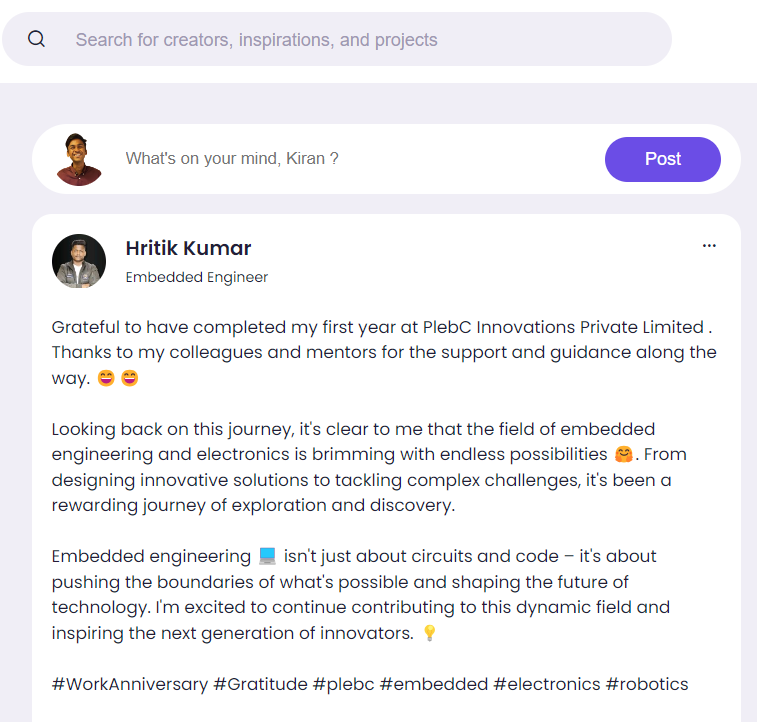    

<h2 id="feature13">13. Fully Responsive for all types of Screen (Mobile, Tablet & Desktop).</h2>

Our project is fully responsive, ensuring optimal performance and a seamless user experience across all screen types, including mobile, tablet, and desktop. The design adapts fluidly to different screen sizes and orientations, maintaining functionality and aesthetics. This responsiveness enhances accessibility and usability, allowing users to interact with the application effortlessly, regardless of the device they use.

   
<h2>Desktop Screen </h2>   
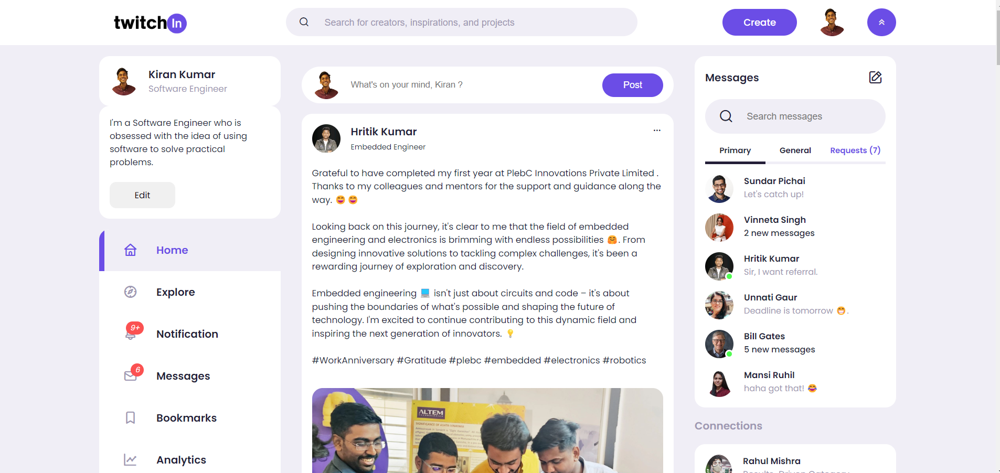  
 
<h2>Tablet Screen  </h2>   
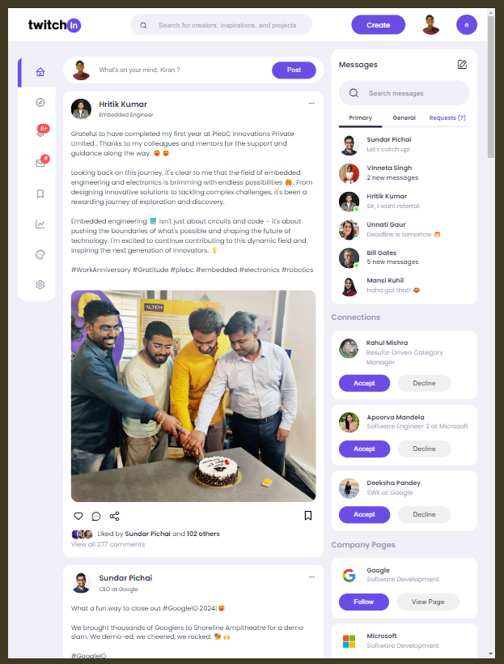  
 
<h2>Mobile Screen  </h2>   
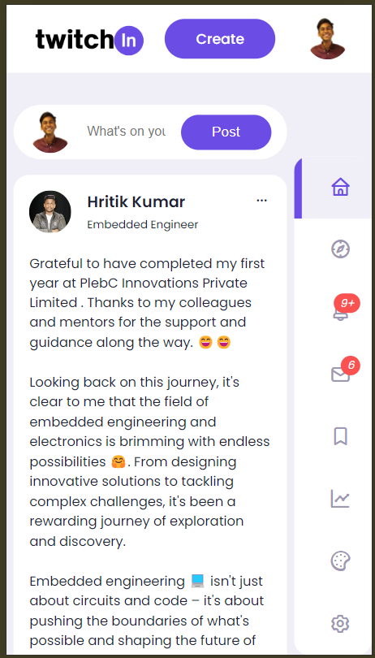     

<h2 id="feature14">14. Clean, maintainable, and well-documented code.</h2>

Ensuring clean, maintainable, and well-documented code is a key feature of our project. This approach enhances readability, simplifies debugging, and facilitates easier updates and collaboration among developers. Well-structured code with clear comments and documentation ensures that future maintenance and scalability are seamless, reducing technical debt and improving overall project quality. By adhering to best practices and coding standards, our project remains robust, efficient, and adaptable to evolving requirements.
  
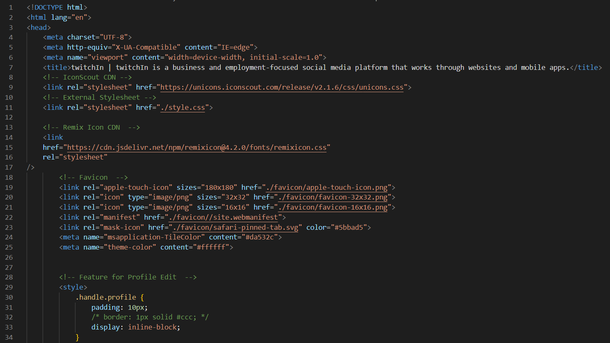     

<h2 id="feature15">15. Creative & Innovative User Experience.</h2>

Our project emphasizes a creative and innovative user experience, ensuring that every interaction is engaging and intuitive. We focus on unique design elements, seamless navigation, and interactive features that captivate users and enhance usability. By prioritizing creativity and innovation, we aim to deliver a memorable and effective user experience that stands out and meets the evolving needs of our audience.
   
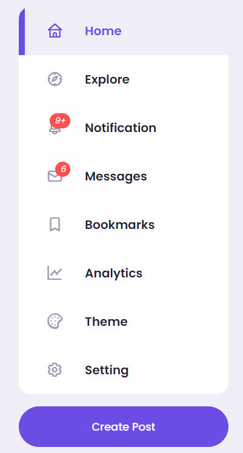     

<h2 id="feature16">16. Smoothness and Intuitiveness of interactive elements.</h2>

The smoothness and intuitiveness of interactive elements in our project significantly enhance user experience. Every interaction, from button clicks to form inputs, is designed to be fluid and responsive, ensuring that users navigate the interface effortlessly. The intuitive design means users can easily understand and engage with the features without a steep learning curve, making the overall experience seamless and enjoyable.
   
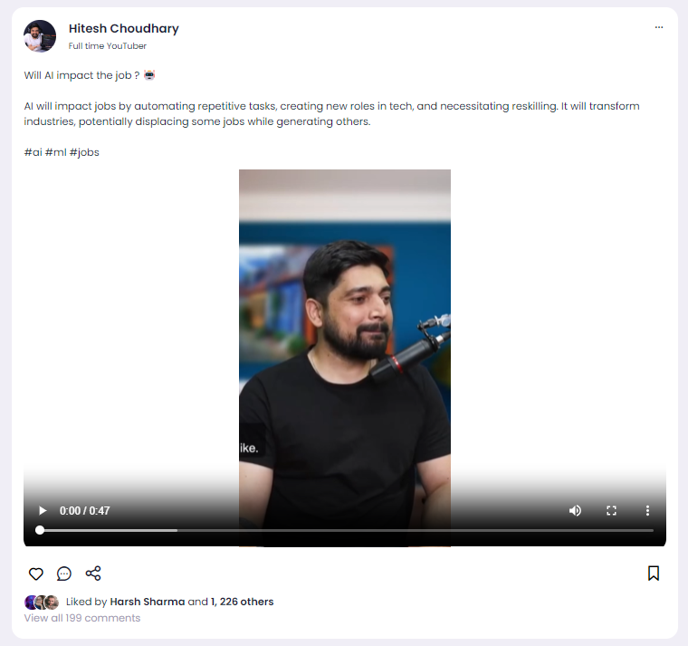     

<h2 id="feature17">17. Creative & Innovative User Experience.</h2>

Our project prioritizes a creative and innovative user experience, ensuring that users engage with an intuitive and visually appealing interface. By integrating cutting-edge design principles and interactive elements, we create a seamless and enjoyable journey for users. This focus on innovation not only enhances usability but also makes the application memorable and distinctive, setting it apart from competitors. Our commitment to user-centered design guarantees that every interaction is smooth, efficient, and delightful.
   
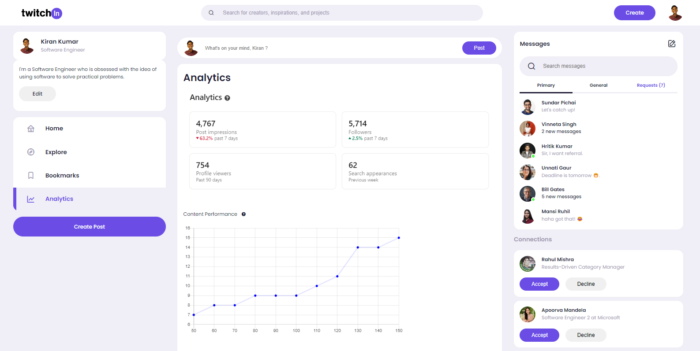     

<h2>Thanks 😁</h1>

Contact:  kk9840042@gmail.com 

 

<h1>License</h1>

This project is proprietary and confidential. Unauthorized copying, distribution, or modification of this code, via any medium, is strictly prohibited. For more details, see the LICENSE file.
